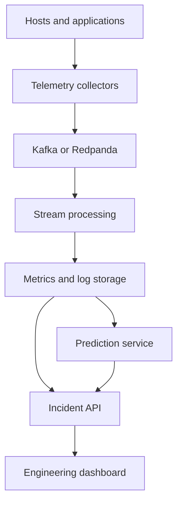

# Real-Time System Monitoring

A production-oriented predictive observability platform for detecting
developing system risks before they become incidents.

The project will ingest infrastructure metrics, logs, traces, deployment
events, and privacy-preserving behavior signals. It will correlate those
signals, detect anomalies, forecast resource exhaustion, and present
actionable evidence to engineers during incidents.

> Status: Phase 1 — Linux telemetry collector foundation.

## Current capabilities

- Collects Linux CPU load, memory, disk, network, uptime, and process counts.
- Emits one versioned JSON event per collection interval.
- Uses only the Python standard library at runtime.
- Runs on headless, CPU-only Linux systems; no GPU is required.
- Handles shutdown signals and collection errors without producing malformed
  telemetry.
- Includes automated tests, type checking, linting, and CI configuration.

## Planned architecture



See [the architecture overview](docs/architecture/overview.md) for component
responsibilities and failure boundaries.

## Quick start

Requires Python 3.12 or newer on Linux.

```bash
python -m venv .venv
source .venv/bin/activate
python -m pip install -e ".[dev]"
rtmonitor --once
```

Run continuously at a five-second interval:

```bash
rtmonitor --interval 5
```

Each line is a self-contained JSON event suitable for piping into another
process:

```bash
rtmonitor --interval 5 | jq .
```

## Development

```bash
python -m unittest discover -s tests -v
ruff check .
mypy src
```

On NixOS:

```bash
nix develop
```

## Roadmap

1. Linux telemetry collector
2. Versioned event contracts and ingestion API
3. Durable event streaming with backpressure
4. Time-series and log storage
5. Incident-focused React dashboard
6. Anomaly detection and resource forecasting
7. Multi-node deployment, load testing, and failure injection

## Production-readiness policy

The repository is production-oriented, but it is not described as
production-ready until its security, recovery, capacity, and reliability
targets have been validated. See [CONTRIBUTING.md](CONTRIBUTING.md) and the
[skill evidence ledger](docs/skill-evidence.md).

## License

MIT

