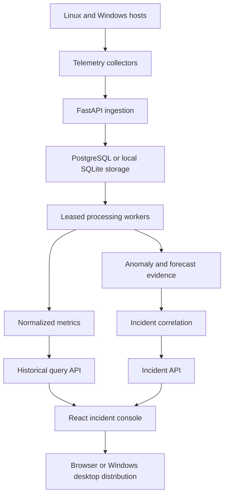

# Real-Time System Monitoring

A production-oriented predictive observability platform for detecting developing system risks before they become incidents.

The platform collects infrastructure telemetry, stores and processes events durably, detects explainable anomalies, forecasts resource exhaustion, and presents auditable incident evidence to operators.

> Status: Version 1.1.0 — Windows desktop distribution and public product website.

## Download for Windows

Download the self-contained Windows application:

- [RealTimeSystemMonitoring.exe](https://github.com/zecurb/Real-Time-System-Monitoring/releases/latest/download/RealTimeSystemMonitoring.exe)
- [SHA-256 checksum](https://github.com/zecurb/Real-Time-System-Monitoring/releases/latest/download/RealTimeSystemMonitoring.exe.sha256)
- [Product website](https://zecurb.github.io/Real-Time-System-Monitoring/)

The executable requires Windows 10 or 11 on x64 hardware. It collects local Windows telemetry, creates its local SQLite database, applies migrations, starts the background processing worker, serves the bundled incident console, and opens the console in the default browser.

The initial executable is not Authenticode-signed, so Windows may display an unrecognized publisher warning. Verify the published SHA-256 checksum before running it.

## Current capabilities

- Collects Linux and Windows load, CPU count, memory, disk, network, uptime, and process-count telemetry.
- Emits one versioned JSON event per collection interval.
- Keeps collection lightweight while the API, storage, and prediction services use bounded dependencies.
- Runs on CPU-only systems; no GPU is required.
- Handles shutdown signals and collection errors without producing malformed telemetry.
- Validates versioned telemetry through a FastAPI ingestion service.
- Provides request correlation, structured logs, health checks, payload limits, and storage-aware readiness.
- Persists telemetry through SQLAlchemy with idempotent event IDs, Alembic migrations, PostgreSQL production support, and SQLite desktop/development support.
- Atomically enqueues accepted telemetry for asynchronous processing.
- Runs independent CPU-only workers with bounded batches, expiring leases, competing-worker isolation, exponential retry, and dead-letter handling.
- Reports pipeline depth and per-state totals for incident visibility.
- Normalizes every telemetry event into 14 indexed metric samples using conflict-safe, retry-idempotent bulk writes.
- Serves bounded historical queries with stable cursor pagination.
- Prunes expired metric samples in bounded retention batches.
- Provides a responsive React and TypeScript incident console with node discovery, pipeline health, historical charts, resilient auto-refresh, and explicit degraded-data states.
- Detects unusual load, process, memory, and disk behavior with robust per-node median/MAD baselines and durable, explainable severity findings.
- Forecasts reliable memory and disk threshold crossings with confidence, risk, backtesting, and observable CPU/GPU provider selection.
- Correlates anomaly and forecast evidence into durable incidents by node and metric, with retry-safe occurrence counting and severity escalation.
- Supports acknowledgement, resolution, reopening, optimistic revision checks, ownership, and an immutable operator timeline.
- Builds and smoke-tests a self-contained Windows executable through GitHub Actions.
- Publishes a GitHub Pages product website and checksummed Windows release assets.
- Includes automated tests, strict type checking, linting, frontend validation, CI, CodeQL, Dependabot, and tagged release automation.

## Architecture



See [the architecture overview](docs/architecture/overview.md) for component responsibilities and failure boundaries.

## Linux and source quick start

Requires Python 3.12 or newer on Linux.

```bash
python -m venv .venv
source .venv/bin/activate
python -m pip install -e ".[dev]"
rtmonitor --once
```

Start the ingestion API:

```bash
alembic upgrade head
rtmonitor-api
```

Then open `http://127.0.0.1:8000/docs`. See the [ingestion API guide](docs/api/ingestion.md) for contracts and limitations.

Start a worker in another development shell:

```bash
rtmonitor-worker
```

For a smoke test that processes one available batch and exits:

```bash
rtmonitor-worker --once
curl http://127.0.0.1:8000/v1/pipeline/status
```

Query historical memory utilization:

```bash
curl --get http://127.0.0.1:8000/v1/metrics/NODE_ID \
  --data-urlencode "metric=memory.used.percent" \
  --data-urlencode "start=2026-07-30T00:00:00+00:00" \
  --data-urlencode "end=2026-07-31T00:00:00+00:00" | jq .
```

Query anomalies detected in a bounded window:

```bash
curl --get http://127.0.0.1:8000/v1/anomalies \
  --data-urlencode "start=2026-07-30T00:00:00+00:00" \
  --data-urlencode "end=2026-07-31T00:00:00+00:00" | jq .
```

Inspect the active prediction provider and current resource forecasts:

```bash
curl http://127.0.0.1:8000/v1/runtime | jq .
curl http://127.0.0.1:8000/v1/forecasts | jq .
```

Inspect and operate the incident queue:

```bash
curl http://127.0.0.1:8000/v1/incidents | jq .

curl -X POST http://127.0.0.1:8000/v1/incidents/INCIDENT_ID/acknowledge \
  -H "Content-Type: application/json" \
  --data '{"actor":"on-call","note":"Investigating","expected_revision":1}'

curl -X POST http://127.0.0.1:8000/v1/incidents/INCIDENT_ID/resolve \
  -H "Content-Type: application/json" \
  --data '{"actor":"on-call","note":"Capacity restored","expected_revision":2}'
```

See the [incident-response runbook](docs/runbooks/incident-response.md) before operating a production deployment.

CPU execution is the reliable default on every host. Set `RTMONITOR_EXECUTION_PROVIDER=auto|cpu|gpu` before starting the API and worker. `auto` uses a compatible CUDA device through an operator-installed CuPy build when available and otherwise reports the reason for its CPU fallback. GPU packages are intentionally optional because the correct CuPy build depends on the host's CUDA runtime.

Prune samples older than 30 days in bounded batches:

```bash
rtmonitor-retention --days 30
```

Start the dashboard development server in a separate shell:

```bash
cd frontend
npm ci
npm run dev
```

Open `http://127.0.0.1:5173`. The Vite development proxy forwards API calls to `http://127.0.0.1:8000`.

Run continuously at a five-second interval:

```bash
rtmonitor --interval 5
```

Each line is a self-contained JSON event suitable for piping into another process:

```bash
rtmonitor --interval 5 | jq .
```

## Development and validation

```bash
python -m ruff check .
python -m mypy src
python -m unittest discover -s tests -v
npm --prefix frontend run check
npm --prefix frontend test
npm --prefix frontend run build
nix flake check
```

On NixOS, enter the reproducible development shell first:

```bash
nix develop
```

## Release history

Version 1.1.0 adds the eleventh implementation phase:

11. Windows telemetry, self-contained desktop packaging, checksummed release assets, and public website deployment

Version 1.0.0 completed the initial ten phases:

1. Linux telemetry collector
2. Versioned event contracts and ingestion API
3. Durable event storage and idempotent ingestion
4. Durable distributed processing foundation
5. Normalized time-series storage and historical query APIs
6. Incident-focused React and TypeScript dashboard
7. Explainable CPU-based anomaly detection
8. Resource forecasting and failure-risk prediction
9. Alerts and incident workflows
10. Security, release automation, operational documentation, and production hardening

See [CHANGELOG.md](CHANGELOG.md) for release details.

## Production-readiness statement

Version 1.1.0 retains the repository's automated Python, frontend, Nix, dependency, and security gates and adds a Windows packaging workflow that smoke-tests API readiness, dashboard delivery, and local Windows node discovery.

The desktop executable is a local single-node distribution using SQLite and one worker. It is not a replacement for the PostgreSQL-backed multi-worker production topology.

The platform remains operator-managed software rather than a hosted managed service. Production deployments must provide authentication, authorization, trusted operator identity, TLS termination, secrets management, rate limiting, network isolation, capacity validation, and tested database backup and restoration.

See the [production-readiness checklist](docs/production-readiness.md), [security policy](SECURITY.md), and [support policy](SUPPORT.md).

## License

Copyright (c) 2026 Nehemiah Boyce. All rights reserved.

This is source-visible proprietary software. The public repository may be viewed for portfolio and evaluation purposes, but it does not grant permission to use, copy, modify, distribute, deploy, sublicense, or sell the software. Commercial use requires a separate written license. See [LICENSE](LICENSE).
