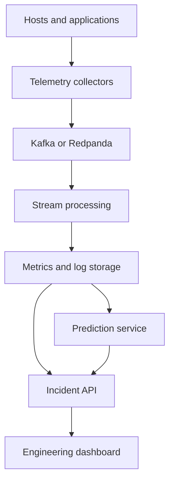

# Real-Time System Monitoring

A production-oriented predictive observability platform for detecting
developing system risks before they become incidents.

The project will ingest infrastructure metrics, logs, traces, deployment
events, and privacy-preserving behavior signals. It will correlate those
signals, detect anomalies, forecast resource exhaustion, and present
actionable evidence to engineers during incidents.

> Status: Phase 8 — hardware-aware resource forecasting.

## Current capabilities

- Collects Linux CPU load, memory, disk, network, uptime, and process counts.
- Emits one versioned JSON event per collection interval.
- Keeps collection lightweight while the API, storage, and prediction services
  use pinned Python dependencies.
- Runs on headless, CPU-only Linux systems; no GPU is required.
- Handles shutdown signals and collection errors without producing malformed
  telemetry.
- Validates versioned telemetry through a FastAPI ingestion service.
- Provides request correlation, structured logs, health checks, payload limits,
  and storage-aware readiness.
- Persists telemetry through SQLAlchemy with idempotent event IDs, Alembic
  migrations, PostgreSQL production support, and SQLite development support.
- Atomically enqueues accepted telemetry for asynchronous processing.
- Runs independent CPU-only workers with bounded batches, expiring leases,
  competing-worker isolation, exponential retry, and dead-letter handling.
- Reports pipeline depth and per-state totals for incident visibility.
- Normalizes every telemetry event into 14 indexed metric samples using
  conflict-safe, retry-idempotent bulk writes.
- Serves bounded historical queries with stable cursor pagination.
- Prunes expired metric samples in bounded retention batches.
- Provides a responsive React and TypeScript incident console with node
  discovery, pipeline health, historical charts, resilient auto-refresh, and
  explicit degraded-data states.
- Detects unusual load, process, memory, and disk behavior with robust
  per-node median/MAD baselines and durable, explainable severity findings.
- Forecasts reliable memory and disk threshold crossings with confidence,
  risk, backtesting, and observable CPU/GPU provider selection.
- Includes automated tests, type checking, linting, and CI configuration.

## Planned architecture



See [the architecture overview](docs/architecture/overview.md) for component
responsibilities and failure boundaries.

## Quick start

Requires Python 3.12 or newer on Linux.

```bash
python -m venv .venv
source .venv/bin/activate
python -m pip install -e ".[dev]"
rtmonitor --once
```

Start the ingestion API:

```bash
alembic upgrade head
rtmonitor-api
```

Then open `http://127.0.0.1:8000/docs`. See the
[ingestion API guide](docs/api/ingestion.md) for contracts and limitations.

Start a worker in another development shell:

```bash
rtmonitor-worker
```

For a smoke test that processes one available batch and exits:

```bash
rtmonitor-worker --once
curl http://127.0.0.1:8000/v1/pipeline/status
```

Query historical memory utilization:

```bash
curl --get http://127.0.0.1:8000/v1/metrics/NODE_ID \
  --data-urlencode "metric=memory.used.percent" \
  --data-urlencode "start=2026-07-30T00:00:00+00:00" \
  --data-urlencode "end=2026-07-31T00:00:00+00:00" | jq .
```

Query anomalies detected in a bounded window:

```bash
curl --get http://127.0.0.1:8000/v1/anomalies \
  --data-urlencode "start=2026-07-30T00:00:00+00:00" \
  --data-urlencode "end=2026-07-31T00:00:00+00:00" | jq .
```

Inspect the active prediction provider and current resource forecasts:

```bash
curl http://127.0.0.1:8000/v1/runtime | jq .
curl http://127.0.0.1:8000/v1/forecasts | jq .
```

CPU execution is the reliable default on every host. Set
`RTMONITOR_EXECUTION_PROVIDER=auto|cpu|gpu` before starting the API and worker.
`auto` uses a compatible CUDA device through an operator-installed CuPy build
when available and otherwise reports the reason for its CPU fallback. GPU
packages are intentionally optional because the correct CuPy build depends on
the host's CUDA runtime.

Prune samples older than 30 days in bounded batches:

```bash
rtmonitor-retention --days 30
```

Start the dashboard development server in a separate shell:

```bash
cd frontend
npm ci
npm run dev
```

Open `http://127.0.0.1:5173`. The Vite development proxy forwards API calls to
`http://127.0.0.1:8000`.

Run continuously at a five-second interval:

```bash
rtmonitor --interval 5
```

Each line is a self-contained JSON event suitable for piping into another
process:

```bash
rtmonitor --interval 5 | jq .
```

## Development

```bash
python -m unittest discover -s tests -v
ruff check .
mypy src
```

On NixOS:

```bash
nix develop
```

## Roadmap

1. Linux telemetry collector
2. Versioned event contracts and ingestion API
3. Durable event storage and idempotent ingestion
4. Durable distributed processing foundation
5. Normalized time-series storage and historical query APIs
6. Incident-focused React and TypeScript dashboard
7. Explainable CPU-based anomaly detection
8. Resource forecasting and failure-risk prediction
9. Alerts and incident workflows
10. Multi-node deployment, security, load testing, and failure injection

## Production-readiness policy

The repository is production-oriented, but it is not described as
production-ready until its security, recovery, capacity, and reliability
targets have been validated. See [CONTRIBUTING.md](CONTRIBUTING.md) and the
[skill evidence ledger](docs/skill-evidence.md).

## License

Copyright (c) 2026 Nehemiah Boyce. All rights reserved.

This is source-visible proprietary software. The public repository may be
viewed for portfolio and evaluation purposes, but it does not grant permission
to use, copy, modify, distribute, deploy, sublicense, or sell the software.
Commercial use requires a separate written license. See [LICENSE](LICENSE).
